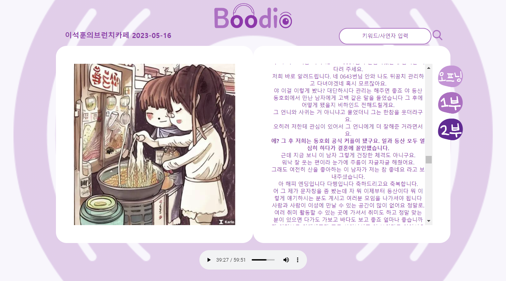
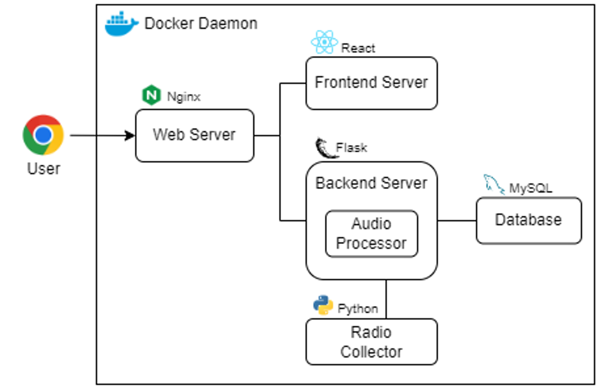
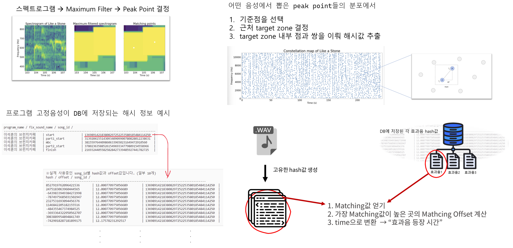
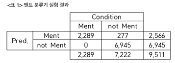
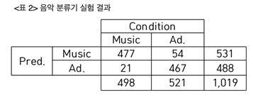
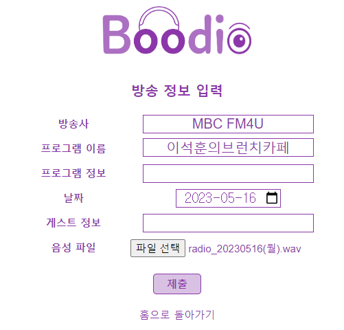

# Boodio
역대 방송된 라디오 프로그램은 아주 방대하고, 각 방송사는 다시 듣기 서비스를 제공하고 있습니다.  
하지만 아쉬운 것은 모든 프로그램이 "스크립트"를 제공하지 않는다는 점과,  
원하는 내용을 찾기 위해서는 라디오 음성을 처음부터 끝까지 직접 들으며 파악해야 한다는 점입니다.  
**원하는 라디오 컨텐츠를 한눈에 찾을 수 있다면, 얼마나 편리할까요?**  
그래서 저희 프로젝트인 Boodio 라디오 포털을 제안합니다.  
(Boodio란, Book처럼 Radio를 볼 수 있다는 의미입니다.)

- 모든 방송사의 프로그램을 하나의 사이트에서 즐길 수 있다.
- 라디오 스크립트가 제공되므로, 기존의 "소리 데이터를 검색"할 수 있게 된다.
- 라디오 스크립트를 통해, 진행 내용을 한눈에 파악할 수 있다.
- 청취자 번호 검색을 통해, 내가 등장한 라디오 및 회차를 빨리 찾아볼 수 있다.

이는 기존에 없던 신개념 라디오 컨텐츠입니다. 
**라디오의 시각화라니, 흥미롭지 않나요?**

라디오 음성 데이터 실시간 수집으로 시작하여, Shazam 알고리즘을 활용한 오디오 분할, STT(Speech To Text), 라디오 포맷(멘트, 노래, 광고) 분류, 최종 시청각 컨텐츠까지 일련의 과정을 자동화하여 제공하고 있습니다.  

  
 
 

### 시연영상 URL : https://www.youtube.com/watch?v=ODWMcz5iefM&t=3s&ab_channel=%EC%8B%A0%EA%B2%BD%EC%A4%80 ###

 
 

## 전체 오디오 프로세싱 과정  
  

 
 

## 웹 서비스 아키텍처  
  

 
 

# 기술  
### ■ 해시 분할
애플 뮤직이 인수한 'Shazam' 사는 해시기반 노래인식기술을 개발했습니다. (: 음악의 일부를 들려주더라도, 해당 음악의 고유 해시값을 통해 노래 전체를 맞출 수 있는 알고리즘입니다)  

저희는 이 알고리즘을 반대로 활용하여 "라디오 고정 효과음 기반 음성 분할"을 구현했습니다. 
- 저희 DB에는 각 라디오 프로그램별로 고정적으로 존재하는 효과음성(라디오 오프닝, MBC 효과음, 정각 알림 등)의 스펙트로그램 해시값을 저장해둡니다. 각 효과음이 출현하는 시간정보(구간)도 함께 저장해둡니다.
- 해당 프로그램의 라디오 녹음파일이 인풋되면, 전체 해시 정보를 추출합니다.
- 전체 해시 정보를 DB에 저장되어있는 고정 음성의 해시값으로 스캔하여, 분할 지점을 확정합니다.  

  

 

### ■ 전체 스크립트 생성
**∨ Whisper**  
OpenAI의 whisper model을 사용하여 Speech To Text(STT)를 진행합니다. STT의 대상은 전체 녹음 음성입니다. time, txt 정보가 담긴 스크립트를 제작합니다.

**∨ 중복 문장 제거**  
whisper는 훌륭한 LLM 모델이지만, STT를 진행할 때 일부 대중가요 또는 광고 음성 구간에서 동일한 표현이 중복되어 출력되는 문제가 있었습니다. 관련 개념은 whisper의 temperature, beam size, entropy threshold 값이고 이들은 하이퍼파라미터로 초기 설정이 가능합니다. 그러나 다양한 음성 케이스에 대해 하이퍼파라미터 튜닝을 통한 중복 표현 문제를 완전히 피할 수는 없었습니다. 따라서 저희는 STT작업 이후에 "중복 문장 제거" 과정을 거쳤습니다. 이 과정이 필요한 이유는, 다음 과정인 포맷 분류에서 사용할 BERT 모델의 인풋 데이터로 저품직 데이터가 사용되지 않도록 처리하기 위함입니다. 

**∨ 문장 단위 조정**  
whisper는 word-level로 시간정보를 얻기 때문에 STT 결과는 문장 단위가 아닌 구절의 형식을 갖추었습니다. 따라서 종결어미가 등장하면 하나의 문장으로 판단하고, 구절을 문장으로 합치도록 후처리하였습니다.

 

### ■ 포맷 분류
라디오 포맷은 핵심적으로 "멘트 / 노래 / 광고" 가 존재합니다.  
이 포맷별로 적절한 컨텐츠를 제공하기 위해서는, 전체 오디오의 포맷 파악 및 분류가 필요합니다. 특히 멘트 컨텐츠는 소실되지 않아야 하므로, 멘트 분류기의 성능이 중요합니다.
 
### 멘트 분류기 (ResNet18)
멘트 손실률은 0%, 정확도는 97.1%입니다.  
  

**∨ 멘트 분류기(ResNet18 사용)**  
1초 스펙트로그램 데이터를 통해 멘트를 분류합니다.  
유의할 점은, 원본 오디오 그대로의 스펙트로그램을 사용하여 멘트를 분류할 때 "배경음악이 있는 멘트"와 "잔잔한 노래"를 구분하는 것에 어려움이 있습니다. 목소리의 음정 유무로 분류를 진행해야 하는데, 배경음악이 혼재된 상태에서는 특징 차이가 명확히 보이지 않았습니다.  
따라서 Spleeter를 통해 MR을 제거한 음성의 스펙트로그램 이미지를 Resnet18의 인풋으로 사용하였습니다.

**∨ 후보정**  
모델이 예측한 결과는 실제 멘트 구간을 정확하게 표현하지 못합니다. 1초마다 예측한 값은 대부분 정답이지만, 중간중간 오답이 존재합니다. 라디오 포맷의 시간적 연속성을 고려할 때, 멘트 구간을 한번 더 보정해주는 것이 필요합니다. 따라서 최종적으로 멘트 구간의 손실이 없는 분류과정을 완성할 수 있었습니다.
 
### 노래 / 광고 분류기
정확도는 92.6% 입니다.  
  

**∨ 텍스트 기반 분류 (BERT모델 사용)**  
"멘트가 아닌 구간"을 알고 있는 상태입니다. 이제 "멘트가 아닌 구간"에서 노래와 광고 포맷을 분류해 낼 차례입니다. 만약 멘트 분류기처럼 스펙트로그램 데이터를 사용할 경우, 노래와 유사한 광고를 분류하지 못하는 단점이 존재합니다. 따라서 "텍스트 기반 분류"를 고안했습니다. "노래 가사"와 "광고 대본"의 텍스트적 특성이 뚜렷하기 때문에 분류가 가능합니다.

 

### ■ 문단구성 및 컨텐츠 생성
**∨ 문단 분류**  
개별 문장 단위보다 문단 단위에서의 정보량이 더 많기 때문에 컨텐츠를 추출하기 용이합니다. 따라서 인접 문장 간 벡터 유사도에 따라 문단을 구성했습니다.
현재 사용중인 벡터화 도구는 tf-idf이며 각 토큰 문장 가중치 벡터의 제곱합이 항상 1이 되도록 l2 norm 정규화를 적용하였습니다. 두 문장간 벡터 거리를 통해 문장으로 묶을지 판단할 때 거리값의 일관성을 위해서입니다.
인접한 문장의 벡터 거리는 최대 √2가 되며, 이는 유사도가 전혀 없음을 의미합니다. 따라서 두 문장 간 벡터 거리가 1.4보다 작다면 하나의 문단으로 그룹화하였습니다. 라디오 진행은 짧은 문장의 연속으로 이루어지므로, 맥락이 이어지는 상황에서 동일 단어가 출현하는 경향이 높다는 특성을 가지고 있기 때문입니다.

**∨ 키워드 추출**  
문단 내에서 의미 있는 명사를 키워드로 설정합니다. 각 문단을 명사 토큰화한 후 tf-idf를 수행하였고, 토큰을 가중치 순으로 정렬하여 상위 6개의 명사를 해당 문장의 키워드로 취하고 있습니다.  

**∨ 컨텐츠 생성**
- **문단별 사진**  
각 문단 내용에 관련한 그림을 생성하고자 kakaobrain의 이미지 생성 모델 Karlo를 사용하였습니다. 앞서 얻은 문단별 키워드의 나열을 영번역하여 input prompt를 만들고 Karlo에 입력하여 관련 이미지를 생성합니다. 이때 Karlo에 negative prompt를 지정하여 부적절한 이미지 생성을 방지하였습니다.
- **유튜브 영상**  
라디오의 노래 구간에서 제공되는 컨텐츠는 뮤직비디오입니다. 정규 표현식을 통해 가수와 노래명을 추출한 뒤 유튜브 API로 검색하여 얻습니다.

 
 

## 수집  
방송사별 수집기가 python 프로세스로 돌아갑니다.  
수집기에 방영시각 및 녹화총시간을 입력해두면, 스케줄러가 돌아가며 방송사가 제공하는 streamlink를 통해 자동 녹화 및 수집합니다.  

 
 

## 업로드  
방송사 관계자는 직접 라디오 녹음파일을 업로드할 수 있습니다 (관리자 페이지)  
업로드 직후 오디오 프로세싱 작업이 자동으로 이루어집니다.

  
